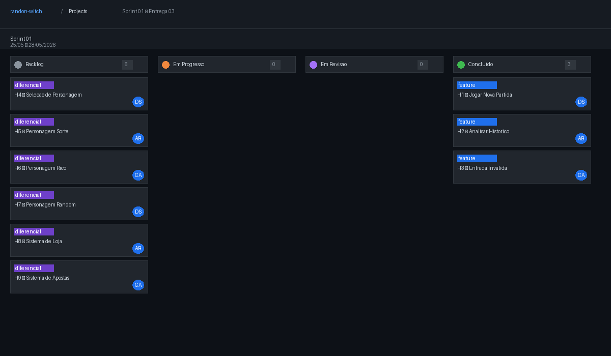
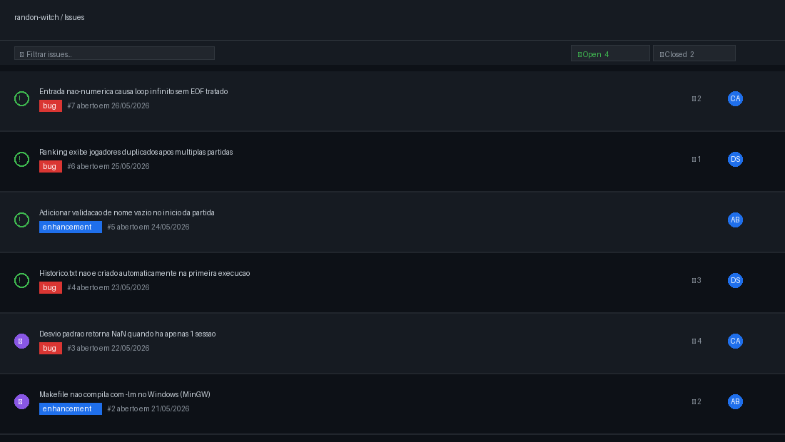

# RANDON-WITCH — Jogo de Adivinhacao

Projeto Integrador da disciplina de Programacao Imperativa e Funcional (PIF)
Curso de Analise e Desenvolvimento de Sistemas — 2026.1

## Equipe
- Ana Beatriz Bezerra Lopes da Costa
- Claudemir Pereira de Araujo Filho
- Drielly Santiago dos Santos

---

## Sobre o Projeto

Jogo de adivinhacao desenvolvido em linguagem C onde o sistema sorteia um numero dentro de um intervalo definido pela dificuldade escolhida. O jogador tenta descobri-lo atraves de palpites e recebe uma dica a cada tentativa ("Muito baixo" / "Muito alto" / "Acertou"). Toda partida e registrada em arquivo, alimentando um modulo de analise estatistica (com recursao) e um ranking de jogadores.

---

## Funcionalidades

### Modos de Jogo

- **Jogar nova partida** — escolhe a dificuldade, sorteia o numero, recebe palpites com dicas; ao final salva a sessao e atualiza o ranking (se acertou).
- **Analisar historico** — exibe relatorio por partida e estatisticas agregadas, com sugestoes de estrategia. Permite ver todas as partidas ou filtrar por jogador.
- **Ranking** — placar dos jogadores ordenado por desempenho, salvo em arquivo.

### Niveis de Dificuldade (H4 — Sprint 01)

| Nivel   | Intervalo | Limite de Tentativas |
|---------|-----------|----------------------|
| Facil   | 1 a 50    | Sem limite           |
| Medio   | 1 a 100   | Sem limite           |
| Dificil | 1 a 200   | 10 tentativas        |

No modo Dificil, se o jogador esgotar as 10 tentativas sem acertar, o jogo encerra exibindo o numero correto.

### Analise e Estatisticas

- Relatorio individual de cada partida (data, jogador, numero alvo, sequencia de palpites).
- Estatisticas agregadas: total de sessoes, soma e media de tentativas, melhor e pior sessao, desvio padrao e vies baixo/alto.
- Sugestoes textuais de estrategia baseadas no historico (busca pelo meio, busca binaria, equilibrio de vies).

---

## Historias Implementadas — Sprint 01

| Historia | Descricao | Status |
|----------|-----------|--------|
| H1 | Jogar nova partida: sorteio, loop de palpites, dicas e registro da sessao | Concluido |
| H2 | Analisar historico: leitura com `fgets`, recursao, estatisticas e sugestoes | Concluido |
| H3 | Entrada invalida: validacao de intervalo, limpeza de buffer, EOF handling | Concluido |
| H4 | Nivel de dificuldade: Facil/Medio/Dificil com intervalos e limite de tentativas | Concluido |

---

## Requisitos Funcionais (RF)

| Cod. | Descricao |
|------|-----------|
| RF01 | Geracao do numero alvo com `rand()` e `srand()` a cada sessao |
| RF02 | Loop de palpites com validacao de intervalo e dicas: "Muito baixo", "Muito alto", "Acertou" |
| RF03 | Registro da sessao em arquivo texto: timestamp, nome, alvo, tentativas, palpites abaixo/acima e sequencia CSV |
| RF04 | Leitura do historico com `fgets()` e reconstrucao das sessoes para analise |
| RF05 | Calculo de estatisticas: total de sessoes, media, melhor/pior sessao, desvio padrao e vies baixo/alto |
| RF06 | Uso de recursao em soma, minimo, maximo e soma dos quadrados das diferencas |
| RF07 | Sugestoes textuais de estrategia baseadas no historico |
| RF08 | Selecao de nivel de dificuldade com intervalo e limite de tentativas variaveis |

## Requisitos Nao Funcionais

- Multiplataforma: Windows, Linux e macOS
- Compativel com compiladores C11
- Sem dependencias externas (apenas a libm, via `-lm`)
- Persistencia em arquivo texto simples
- Codigo modular e legivel

---

## Estrutura do Projeto

```
RANDON-WITCH/
├── main.c              # Menu principal e ponto de entrada
├── jogo.c / .h         # Logica da partida, dificuldade e itens da loja
├── historico.c / .h    # Escrita e leitura do arquivo de sessoes
├── estatisticas.c / .h # Estatisticas e sugestoes (com recursao)
├── ranking.c / .h      # Registro e exibicao do ranking
├── loja.c / .h         # Loja de premios, moedas e itens do jogador
├── utils.c / .h        # Leitura validada de entrada, limpeza de buffer e EOF handling
├── tipos.h             # Structs Jogador e Sessao, enum Dificuldade
├── Makefile            # Compilacao e execucao
├── historico.txt       # Arquivo de sessoes (gerado em tempo de execucao)
├── ranking.txt         # Arquivo de ranking (gerado em tempo de execucao)
├── moedas.txt          # Saldo de moedas por jogador (gerado em tempo de execucao)
├── itens.txt           # Dicas de intervalo disponiveis por jogador
├── bonus.txt           # Palpites bonus disponiveis por jogador
├── dezena.txt          # Dezenas reveladas disponiveis por jogador
├── screencast.html     # Screencast interativo da execucao (Sprint 02)
├── docs/               # Imagens do sprint board, backlog e issue tracker
└── README.md
```

---

## Compilacao e Execucao

```bash
make        # compila o executavel "jogo"
make run    # compila e executa
make clean  # remove o executavel
```

---

## Menu Principal

```
=== RANDON-WITCH: Jogo de Adivinhacao ===
1 - Jogar
2 - Analisar historico
3 - Ranking
4 - Loja
5 - Sair
```

---

## Formato do Historico

Cada sessao e gravada em `historico.txt` como um bloco de chave=valor:

| Campo            | Descricao                                  |
|------------------|--------------------------------------------|
| timestamp        | Data e hora da partida                     |
| nome             | Nome do jogador                            |
| numero_alvo      | Numero sorteado                            |
| total_tentativas | Total de palpites validos                  |
| palpites_baixo   | Quantidade de palpites abaixo do alvo      |
| palpites_alto    | Quantidade de palpites acima do alvo       |
| sequencia        | Lista de todos os palpites separados por virgula |

---

## Tratamento de Erros

| Situacao                              | Comportamento                                      |
|---------------------------------------|----------------------------------------------------|
| Arquivo de historico inexistente      | Exibe "Nenhuma sessao encontrada" e retorna ao menu |
| Historico nao pode ser aberto p/ escrita | Mensagem de erro no terminal; jogo continua      |
| Entrada nao numerica                  | Buffer limpo; solicita novo valor                  |
| Valor fora do intervalo               | Mensagem de erro; tentativa nao e contabilizada    |
| EOF inesperado (Ctrl+D)               | Programa encerra graciosamente via `exit(0)`       |
| Ranking sem partidas registradas      | Mensagem amigavel; sem travamento                  |
| Modo dificil sem acerto em 10 tents. | Game over com revelacao do numero correto          |

---

## Sprint 01 — Quadro e Backlog



A Sprint 01 cobre a semana de 25/05 a 28/05/2026 (Entrega 03). As historias H1, H2, H3 e H4 foram implementadas e movidas para **Concluido**. As historias H5 a H9 permanecem no **Backlog** para entregas futuras.

---

## Issue / Bug Tracker



O tracker de issues esta disponivel na aba **Issues** do repositorio GitHub. Issues abertos referentes a esta entrega: entrada invalida sem tratamento de EOF (#7), duplicacao no ranking (#6), criacao automatica do historico (#4) e validacao de nome vazio (#5). Issues #2 e #3 foram fechados nesta sprint.

---

## Testes de Sistema

O screencast completo da execucao esta disponivel em [`screencast.html`](screencast.html) — abre direto no navegador e demonstra as novas funcionalidades da Sprint 02:

- Jogar partida no modo Medio com ganho de moedas ao acertar
- Loja de premios: compra da Dica de Intervalo e validacao de saldo insuficiente
- Modo Dificil com contador `[X/10]`, indicador de dicas e game over ao esgotar
- Analise do historico com 103+ sessoes, estatisticas e sugestao de estrategia
- Ranking com nome, acertos, tentativas totais, moedas e data do ultimo acerto

---

## Programacao em Par — Sprint 01

Essa sprint foi desenvolvida de de forma assíncrona, cada membro ficou responsavel por uma parte e depois de feita foi passada por revisao :

| Par | Integrantes | Funcionalidades |
|-----|-------------|-----------------|
| Tech Lead- design | Drielly Santiago | responsavel pelo figma, organizaçao  e revisao do projeto. lidou com a parte de documentaçao e distribuiu as tarefas a cada reuniao presencial e depois era checado e conferido via mensagens o andamento do projeto |
| Programador |Claudemir Araujo | H2 — Analisar historico: leitura com `fgets`, reconstrucao de sessoes via recursao, estatisticas agregadas e sugestoes de estrategia |
| QA e programadora | Ana Beatriz - ficou responsavel pela checagem de requisitos, prazos. entregou a implementaçao da loja de premios em C e os screecash da aplicaçao 

A experiencia permitiu identificar em tempo real inconsistencias na validacao de entrada (issue #7) e no comportamento do ranking com multiplas sessoes (issue #6), ambos registrados no tracker.

---

## Loja de Premios (H5/H6 — Sprint 02)

Ao acertar uma partida o jogador ganha moedas proporcionais a eficiencia (menos tentativas = mais moedas, multiplicado pela dificuldade). As moedas podem ser trocadas por itens na loja (opcao 4 do menu).

| Item | Custo | Efeito |
|------|-------|--------|
| Dica de Intervalo | 30 moedas | Durante a partida, digite 0 para revelar se o alvo esta na metade superior ou inferior do intervalo atual |
| Palpite Bonus | 50 moedas | Aplica +3 tentativas automaticamente ao iniciar o modo Dificil |
| Revelar Dezena | 80 moedas | Revela o digito das dezenas do numero alvo ao iniciar a partida |

---

## Historias Implementadas — Sprint 02

| Historia | Descricao | Status |
|----------|-----------|--------|
| H5 | Sistema de moedas: ganho proporcional a eficiencia e persistencia em arquivo | Concluido |
| H6 | Loja de premios: 3 itens funcionais com debito de saldo e aplicacao automatica | Concluido |
| H7 | Data do ultimo acerto adicionada ao ranking | Concluido |

---

## Sprint 02 — Quadro e Backlog


A Sprint 02 cobre a semana de 02/06 a 09/06/2026 (Capstone 3). As historias H5, H6 e H7 foram implementadas e movidas para **Concluido**.

---

## Programacao em Par — Sprint 02

| Par | Integrantes | Funcionalidades |
|-----|-------------|-----------------|
| Par 4 | Ana Beatriz + Drielly Santiago | H5 — Sistema de moedas: calculo proporcional, persistencia em moedas.txt e exibicao de saldo |
| Par 5 | Ana Beatriz + Claudemir Araujo | H6 — Loja de premios: menu de itens, compra com validacao de saldo, aplicacao de Palpite Bonus e Revelar Dezena |
| Par 6 | Drielly Santiago + Claudemir Araujo | H7 — Data no ranking: campo ultima_data em Jogador, leitura/escrita com fscanf/fprintf e exibicao na coluna do ranking |

A experiencia da Sprint 02 permitiu identificar a necessidade de arquivos separados por tipo de item (bonus.txt, dezena.txt) para manter a consistencia com o padrao ja adotado para itens.txt.

---

Projeto desenvolvido para a disciplina de Programacao Imperativa e Funcional — PIF 2026.1
